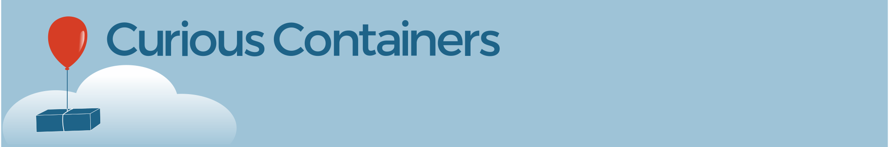

Welcome to the **Curious Containers** project and its **RED** file format for reproducible experiments.

RED (Reproducible Experiment Description) is a JSON or YAML based file format to describe data-driven experiments. A RED file allows researchers to share or publish their computational experiments, such that others can reproduce their results or customize the experiments to their liking. A minimal RED file consists of an application's commandline interface (CLI) description in [Common Workflow Language](https://www.commonwl.org/v1.0/CommandLineTool.html) (CWL) syntax, as well as CLI arguments and input file references.

Curious Containers provides a reference implementation of RED in Python (`cc-core`). Experiments can be executed on a local Linux host using the [Docker](https://www.docker.com/) container runtime via the FAICE tool suite (`cc-faice`). For a more advanced usage Curious Containers Agency (`cc-agency`) can distribute experiments in a Docker cluster across multiple hosts.

Together, RED and Curious Containers support the [FAIR principles](https://www.force11.org/fairprinciples) for reproducible research. If you are new to the project, we advise you to work through the [RED Beginners Guide](red/guide.md).

## Documentation

* [RED Beginners Guide](red-beginners-guide.md)
* [RED Format](red-format.md)
* [RED Connectors](red-connectors.md)
* [RED Engines](red-engines.md)
* [CC Core](cc-core.md)
* [CC FAICE](cc-faice.md)
* [CC Agency](cc-agency.md)
* [Versions](versions.md)
* [Publications](publications.md)

Edit this documentation [here](https://github.com/curious-containers/curious-containers.github.io).

## Acknowledgements

The Curious Containers software is developed at [CBMI](https://cbmi.htw-berlin.de/) (HTW Berlin - University of Applied Sciences). The work is supported by the German Federal Ministry of Economic Affairs and Energy (ZIM project BeCRF, grant number KF3470401BZ4), the German Federal Ministry of Education and Research (project deep.TEACHING, grant number 01IS17056) and HTW Berlin Booster.

 

 Curious Containers Documentation by <a xmlns:cc="http://creativecommons.org/ns#" href="https://www.htw-berlin.de/hochschule/personen/person/?eid=9225" property="cc:attributionName" rel="cc:attributionURL">Christoph Jansen</a> is licensed under a <a rel="license" href="http://creativecommons.org/licenses/by-sa/4.0/">Creative Commons Attribution-ShareAlike 4.0 International License</a>.
